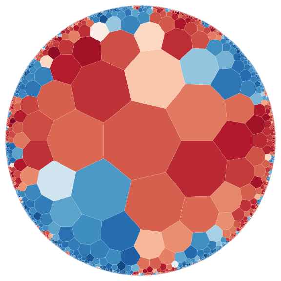

# Hypertiling

This is a Python 3 libary for the fast generation of regular hyperbolic tilings, embedded in the Poincare disk model.

Using efficient algorithms and the power of numpy, hyperbolic graphs with millions of polygons can be created in a matter of minutes on a single CPU. We also provide optimized search algorithms for finding adjacent vertices, which allows to use the graph for all sorts of scientific purposes.

<p align="center">
  
</p>

# Installation

Hypertiling is not yet available for `pip`, but can be locally built on Linux systems using
```
$ python setup.py install
```

For developer mode use
```
$ python setup.py develop
```

# Usage

Import tiling object from *hypertiling* library

```python
from hypertiling import HyperbolicTiling
```
Set parameters, initialize and generate the tiling

```python
p = 7
q = 3
nlayers = 5

T = HyperbolicTiling(p,q,nlayers) 
T.generate()
```

Further information can be found in our Jupyter notebooks in /examples subfolder. 

# Authors
* Manuel Schrauth (mschrauth@physik.uni-wuerzburg.de)
* Felix Dusel

This project is developed at the Institute for Theoretical Physics and Astrophysics, University of Wuerzburg


# License
Every part of hypertiling is available under the MIT license.

