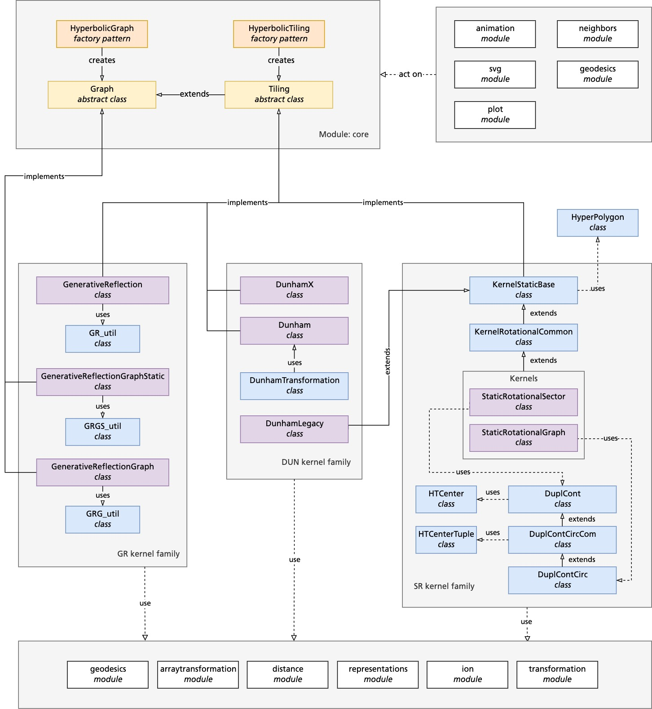

Codemap
=======

We offer a number of different methods for constructing hyperbolic tilings and graphs. At the heart of the package, these are implemented as kernels, each of which contains its own construction algorithm, memory design, auxiliary functions and specific manipulation features. 

This section aims to provide an overview of the relationships among the parts of the library. These are summarized in the hierarchy of classes and modules depicted in the figure below. Both hyperbolic tilings and graphs are typically instantiated through factory functions, highlighted in orange in the diagram. Alternatively, objects can be directly created using constructors of the respective kernel classes. All kernel classes are required to implement the respective abstract base class, either for graph or tiling, marked in yellow. The actual kernel classes themselves are represented in purple. Some kernels share common foundational structures and inherit from shared base classes, depicted in blue. This streamlines the development and maintenance of the library by promoting code reusability. Utility classes, which are essential for the functionality of kernels, but are separated into distinct classes, are also color-coded blue in the figure. 

A range of modules, indicated in white in the diagram, provide auxiliary functions such as distance calculations, coordinate transformations and more. These modules are universally accessible to all kernels and utility classes due to the common interface provided by the abstract base classes. Additional modules for plotting, animation, and neighbor calculations further extend the capabilities of constructed tilings and graphs. These modules typically act upon the tilings and graphs to provide, e.g. visual representations. 

UML type diagram for the \hypertiling library. Rectangles represent classes or modules, while connections between them describe their relationships. Color code: Factory function: orange; abstract base class: yellow; kernel class: purple; shared base class: blue; auxiliary and extension modules: white. Gray regions denote different functional families.